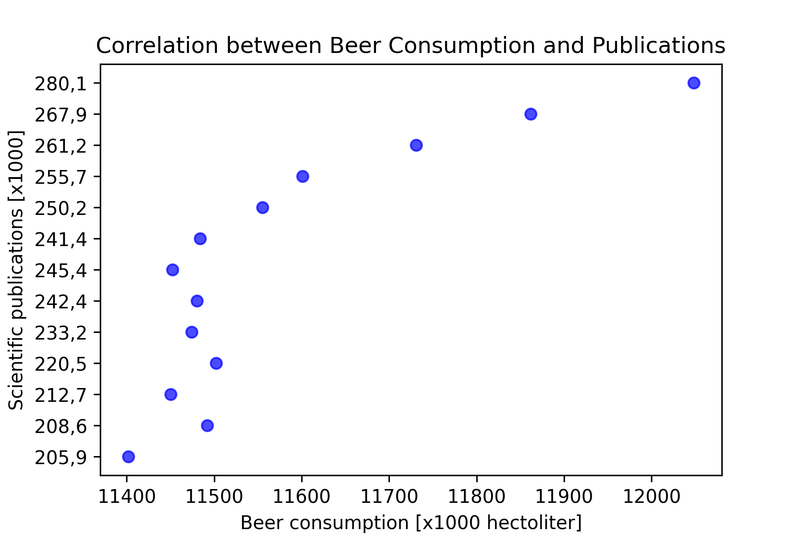

14186152

## Paper titles
- MCC Van Dyke et al., 2019
- JT Harvey, Applied Ergonomics, 2002
- DW Ziegler et al., 2005

## Data Visualization

## Interpretation of the plot
The plot displays the relation between the amount of scientific papers published per year and the annual beer consumption. As amount of pubblished papers per year and the annual beer consumption are almost exclusively increasing, there is a small evidence that there may be a correlation between these two variables.
